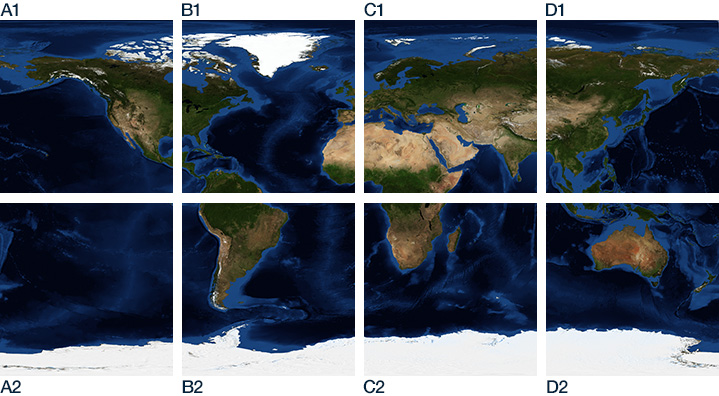

# Credits

## Blue Marble: Next Generation

Images produced by Reto Stöckli, NASA Earth Observatory (NASA Goddard Space Flight Center).

https://visibleearth.nasa.gov/collection/1484/blue-marble

http://earthobservatory.nasa.gov/Features/BlueMarble

## Topography

Imagery by Jesse Allen, NASA's Earth Observatory, using data from the General Bathymetric Chart of the Oceans (GEBCO) produced by the British Oceanographic Data Centre.

https://visibleearth.nasa.gov/images/73934/topography

# Global Image Grid

| column/row | Upper left | Lower right |
|------------|------------|-------------|
| A1         | 90N 180W   | 0N 90W      |
| B1         | 90N 90W    | 0N 0W       |
| C1         | 90N 0W     | 0N 90E      |
| D1         | 90N 90E    | 0N 180E     |
| A2         | 0N 180W    | 90S 90W     |
| B2         | 0N 90W     | 90S 0W      |
| C2         | 0N 0W      | 90S 90E     |
| D2         | 0N 90E     | 90S 180E    |

https://visibleearth.nasa.gov/grid

